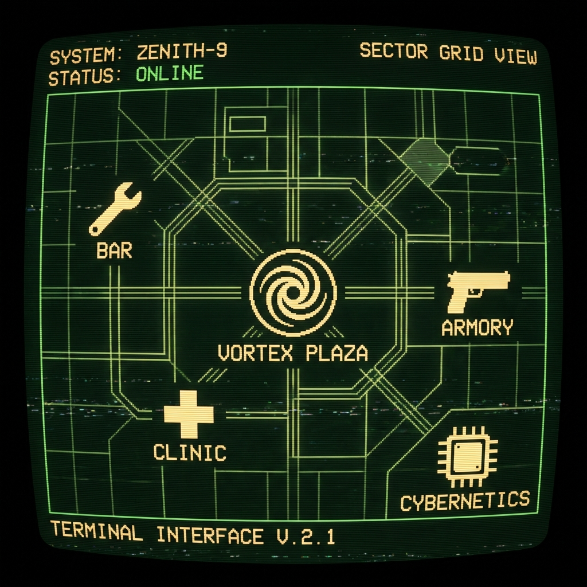

# 🌆 Zenith-9 Area Guide

Welcome to the neon-drenched streets of **Zenith-9**. This guide provides a tactical overview of the metropolis, the digital depths of the Matrix, and the unstable reality pockets known as Glitch Zones.

---

## 🏙️ The Real World

Zenith-9 is a sprawling cyberpunk megalopolis, a concrete jungle where high-tech meets low-life. The city is divided into sectors, each with its own atmosphere and dangers.

### 📍 Key Districts & Locations

#### **The Central Hub**
*   **Arcology Plaza**: The beating heart of Zenith-9. A massive geo-dome housing the city's elite corporate offices and the mysterious **Glitch Door**—a shimmering tear in the fabric of reality.
*   **Reality Breach Chamber**: Located deep within the Plaza, where the laws of physics are merely suggestions.

#### **Commercial & Tech Sector**
*   **Chrome & Steel**: Antiseptic and ozone. This is the premier destination for neural decks, reflex boosters, and high-grade cybernetic implants.
*   **The Armory**: A fortified bunker selling everything from monofilament katanas to heavy-duty ballistic armor. If it kills, they stock it.
*   **Bits & Bytes**: A scavenger's paradise. Cluttered with tech scraps, survival gear, and the essential stimpacks needed to survive another night.

#### **The Underbelly**
*   **The Rusty Cog**: A dim, amber-lit dive bar run by **Roxana "Roxy" Sinclair**. It's the perfect place to grab a cold synth-ale, trade gossip, or find a job that doesn't exist on the books.
*   **Street Doc's Clinic**: A grimy but functional facility. Whether you need a patch-up after a street fight or a quick ripperdoc consultation, this is where you go to stay alive.
*   **The Glitch Club**: Bass that rattles your bones and holographic dancers. A chaotic social hub where the music never stops and the shadows are deep.

#### **The Outskirts**
*   **Synth-Park**: A pathetic imitation of nature featuring fiber-optic trees and holographic grass. Occasionally glitches to reveal the smog-choked sky above.
*   **The Alchemist's Study**: A legendary hidden chamber filled with glowing vials and ancient terminals. Rumored to contain a puzzle that guards a powerful secret.

### 🗺️ City Tactical Map

*Tactical overlay of Zenith-9's primary interest points.*

---

## 🌐 The Matrix (Cyberspace)

The Matrix is the digital shadow of Zenith-9. For every physical street and building, there is a corresponding node in the infinite grid.

### ⌨️ Access & Navigation
Deckers use the `jack_in` command to project their consciousness into the stream. Movement in the Matrix mirrors the physical world but at the speed of thought.

### 💾 Digital Nodes
*   **Central Processing Nexus**: The digital heart of the Plaza.
*   **Encrypted Sub-Nodes**: Secure data vaults corresponding to city shops.
*   **Bio-Data Repository**: The medical database linked to the Clinic.
*   **Social Frequency Hub**: A chaotic storm of data packets mirroring the Club.
*   **Recursive Logic Garden**: A fractal nightmare representing the Synth-Park.
*   **Obfuscated Archive**: The encrypted remains of the Alchemist's secrets.

### 🛡️ Security Protocols
*   **White ICE**: Passive firewalls and guardian programs. They will block your path but rarely strike first.
*   **Black ICE**: Lethal counter-measures. These programs are designed to hunt deckers and deliver lethal biofeedback directly to the brain.

---

## 🌀 The Glitch Zones

When reality frays, the Glitch Zones appear. These are unstable, procedurally generated pockets of "non-space" accessed through the Glitch Door.

*   **The Void**: A shifting labyrinth where the environment itself is hostile.
*   **Glitch Entities**: Distorted remnants of deleted data and corrupted souls that haunt the instability.
*   **Legendary Loot**: Only in the deepest rifts can you find `[GLITCH]` gear—items with stats that shouldn't exist in a stable universe.
